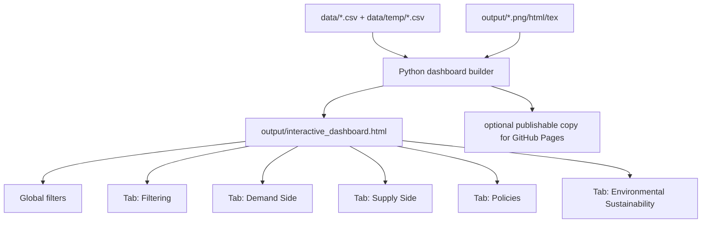

# feat: Consolidate FAOLEX outputs into a single interactive dashboard

## Overview

Build a single generated HTML dashboard that brings the repository's current maps, trend plots, policy-count views, and key policy-level results into one interactive artifact. The dashboard should be easy to open locally, easy to publish from GitHub, and easier to maintain than the current collection of separate files. The same work should also update project documentation and prepare a safe branch transition so this dashboard-backed presentation layer becomes the mainline state of the repository.

## Problem Frame

The repository currently produces valuable outputs, but they are fragmented across standalone PNG, PDF, LaTeX, and HTML files in `output/` plus intermediate data in `data/` and `data/temp/`. A user has to know which file to open for which question, and there is no single interface for switching between demand-side, supply-side, policy-count, and sustainability-focused views. The requested outcome is one polished interactive file with tabbed navigation and filters, plus updated documentation reflecting the current toolchain (`Codex` with `gpt-5.4`, not Claude Code or local open-source models).

The request also includes repo operations: publishing this work back to GitHub, promoting the dashboard state onto `main`, and preserving the previous `main` state on a separate branch. That branch choreography is part of the implementation plan because it changes the public collaboration surface of the repository.

## Requirements Trace

- R1. Produce one primary dashboard artifact that consolidates the main analysis outputs into a single interactive experience.
- R2. The dashboard must expose tabbed navigation aligned with the request: filtering, demand side, supply side, policies, and environmental sustainability.
- R3. The dashboard must support interactive filtering for at least country, year range, strategy dimension, and side/category where relevant.
- R4. The dashboard should be generated from the repository's existing datasets and outputs without introducing a separate long-running web service requirement.
- R5. Existing analysis scripts remain the source of truth for the pipeline; the dashboard is a presentation layer over those results.
- R6. Repository documentation must be updated to describe the dashboard workflow and the current coding assistant/tooling context.
- R7. Branch migration must preserve the old `main` state on a backup branch before promoting the dashboard changes to `main`.

## Scope Boundaries

- In scope: dashboard generation, asset consolidation, tab/filter UX, documentation updates, and branch migration planning.
- In scope: light refactoring of existing output-generation scripts if needed to produce cleaner inputs for the dashboard.
- Out of scope: changing the substantive analysis methodology, recomputing embeddings with a different model, adding authentication, or building a multi-user hosted application.
- Out of scope: replacing every static output with a new bespoke chart when the existing artifact can instead be embedded or re-rendered from current data.

## Context & Research

### Relevant Code and Patterns

- `main.py` is the canonical entry point for end-to-end analysis generation.
- `code/generate_interactive_map.py` and `code/generate_interactive_policy_counts_map.py` already produce self-contained Plotly HTML outputs and establish the repository's interactive visualization pattern.
- `code/generate_trends.py`, `code/generate_policy_counts_trends.py`, `code/world_similarity_map.R`, `code/generate_subgroup_similarity_maps.R`, and `code/generate_policy_count_maps.R` define the current output inventory that the dashboard needs to surface.
- `data/analysis_dataset.csv`, `data/strategy_similarities.csv`, `data/policy_categories.csv`, and `data/temp/world_map_time_series.csv` are the main structured inputs for rebuilding or summarizing views inside a unified dashboard.
- `AGENTS.md` requires final artifacts in `output/` and intermediate assets or logs in `data/temp/`.

### Institutional Learnings

- No `docs/solutions/` directory or reusable dashboard implementation note exists in this repository today, so the plan should avoid assuming prior internal patterns that are not actually present.
- The repo currently has no formal `tests/` suite, so verification has to be introduced deliberately and kept proportional to the new dashboard surface.

### External References

- None used. Local repo context is sufficient for this planning pass because the primary choice is architectural, not framework-specific.

## Key Technical Decisions

- Single-file dashboard artifact rather than Dash server: This matches the user's "one file" goal, avoids introducing deployment/runtime complexity, and aligns with the repository's existing Plotly HTML output pattern.
- Generate the dashboard from source data plus selected existing outputs rather than only iframe-wrapping current HTML files: This allows consistent global filters and tab interactions across sections while still preserving links/previews for existing artifacts.
- Keep `main.py` as the canonical pipeline entry point and add dashboard generation as a downstream output stage: This preserves current workflow expectations and keeps the dashboard reproducible from the same pipeline.
- Use lightweight inline HTML/CSS/JavaScript emitted by Python instead of a new app framework: This avoids adding a web framework dependency when the repo is otherwise script-based.
- Treat branch promotion as a controlled release step with an archive branch for the pre-dashboard `main`: This protects history and gives a clean rollback path.

## Open Questions

### Resolved During Planning

- Delivery model: the dashboard should be a generated HTML artifact in `output/`, not a server application.
- Navigation model: use a global filter panel plus five top-level tabs named for the requested audience views.
- Documentation target: update repository-facing docs to reflect `Codex` with `gpt-5.4` as the current agent/tooling context.

### Deferred to Implementation

- Whether the dashboard should embed static PNGs as previews, regenerate equivalent Plotly figures, or do both in each tab: defer until implementation confirms what best balances fidelity and interaction.
- Whether GitHub Pages should serve the dashboard directly from the repository root, `docs/`, or an exported copy step from `output/`: defer until implementation inspects the preferred publishing path.
- Exact archive branch naming for the old `main` state: defer to implementation, but require a clearly dated or purpose-specific name.

## High-Level Technical Design

> *This illustrates the intended approach and is directional guidance for review, not implementation specification. The implementing agent should treat it as context, not code to reproduce.*

## Implementation Units

- [ ] **Unit 1: Audit dashboard inputs and define the dashboard data contract**

**Goal:** Establish the exact datasets, derived views, and asset references the dashboard generator will consume.

**Requirements:** R1, R3, R5

**Dependencies:** None

**Files:**
- Create: `code/build_dashboard_manifest.py`
- Create: `data/temp/dashboard_asset_manifest.json`
- Create: `tests/test_dashboard_manifest.py`

**Approach:**
- Inventory every output the dashboard needs to expose, grouped by tab and filter relevance.
- Create a machine-readable manifest listing source paths, dashboard section, strategy, side, and display type so the HTML builder is driven by data rather than hard-coded file branches.
- Keep the manifest in `data/temp/` because it is an intermediate assembly artifact, not a source dataset.

**Patterns to follow:**
- Existing repository convention separating intermediates in `data/temp/` from final deliverables in `output/`
- Existing file naming scheme in `output/` for strategy and side combinations

**Test scenarios:**
- Happy path: manifest generation includes all expected strategy trend, subgroup map, policy-count map, and interactive HTML assets.
- Edge case: missing optional asset produces a manifest entry flagged as unavailable rather than silently disappearing.
- Error path: duplicate manifest keys for the same tab/strategy/side combination fail validation.
- Integration: manifest paths resolve against real files present in `data/` and `output/`.

**Verification:**
- A contributor can inspect one manifest file and understand exactly which assets feed each dashboard section.

- [ ] **Unit 2: Add a reusable dashboard builder that outputs one self-contained HTML file**

**Goal:** Create the generator that assembles the dashboard shell, tabs, filters, figures, and asset previews into `output/interactive_dashboard.html`.

**Requirements:** R1, R2, R4, R5

**Dependencies:** Unit 1

**Files:**
- Create: `code/generate_dashboard.py`
- Create: `code/dashboard_builder.py`
- Test: `tests/test_dashboard_builder.py`

**Approach:**
- Read structured data from the CSV inputs and the asset manifest.
- Use Plotly's HTML export for charts that benefit from filter-aware interactivity.
- Emit a single HTML document with inline CSS and JavaScript for tab switching, filter state management, and content visibility.
- Preserve references to existing outputs by embedding previews, summaries, download links, or re-rendered equivalents as appropriate.

**Execution note:** Start with characterization coverage for the generated HTML structure before layering in per-tab interactivity.

**Patterns to follow:**
- Plotly HTML generation pattern already used in `code/generate_interactive_map.py`
- Script-oriented CLI structure used across `code/*.py`

**Test scenarios:**
- Happy path: builder writes one HTML file containing the five requested tabs and a global filter panel.
- Edge case: empty filtered result for a country/year combination renders an explicit "no data" state instead of broken containers.
- Error path: missing manifest or missing required CSV column surfaces a descriptive exception.
- Integration: generated HTML references only repo-generated assets and loads without external local file dependencies other than approved CDN assets already used by Plotly outputs.

**Verification:**
- Opening `output/interactive_dashboard.html` in a browser shows a complete, navigable dashboard without a Python server.

- [ ] **Unit 3: Implement the global filtering model and tab-specific content rules**

**Goal:** Make filters drive the correct subset of content across the five requested views without conflating unrelated outputs.

**Requirements:** R2, R3, R5

**Dependencies:** Unit 2

**Files:**
- Modify: `code/dashboard_builder.py`
- Create: `tests/test_dashboard_filters.py`

**Approach:**
- Define one canonical filter state object covering country, year range, strategy, and policy side.
- Apply filters only where the underlying data supports them; where an artifact is inherently static, show the closest matching asset plus a note explaining the granularity.
- Map the requested tabs to concrete dashboard responsibilities:
  - `Filtering`: control surface plus overview panels and "what changes with this filter" summaries
  - `Demand Side`: demand-only trends, maps, and policy counts
  - `Supply Side`: supply-only trends, maps, and policy counts
  - `Policies`: policy-level tables/cards sourced from `data/analysis_dataset.csv`
  - `Environmental Sustainability`: sustainability-focused trend/map/policy views keyed to `strategy_sus`

**Patterns to follow:**
- Current strategy naming and year windows used in `code/generate_trends.py` and `code/world_similarity_map.R`

**Test scenarios:**
- Happy path: changing side from `both` to `demand` updates demand-side charts and hides supply-only content.
- Edge case: environmental sustainability tab forces or defaults strategy selection to `strategy_sus` while keeping country/year filters active.
- Error path: unsupported filter combination is ignored with a visible explanatory note rather than corrupting the page state.
- Integration: one filter change updates every eligible section consistently within the generated HTML.

**Verification:**
- A reviewer can switch among tabs and see coherent, non-contradictory content for the same filter state.

- [ ] **Unit 4: Add policy-level exploration and summary components**

**Goal:** Surface the policy-level results that are currently buried in CSV files, especially for the policies tab and sustainability-focused review.

**Requirements:** R1, R2, R3

**Dependencies:** Unit 3

**Files:**
- Modify: `code/dashboard_builder.py`
- Modify: `data/analysis_dataset.csv`  # only if implementation needs additional precomputed dashboard columns
- Create: `tests/test_dashboard_policy_views.py`

**Approach:**
- Build policy tables or ranked cards from `data/analysis_dataset.csv`, including title, country, category, date, and strategy similarity values.
- Support sorting and filter-aware subsets, especially top/bottom sustainability-aligned policies and demand/supply splits.
- If additional precomputed fields materially simplify client-side rendering, derive them in a controlled pipeline step rather than mutating raw inputs ad hoc.

**Patterns to follow:**
- Existing column semantics in `code/build_analysis_dataset.py`
- Existing strategy score naming in `data/strategy_similarities.csv`

**Test scenarios:**
- Happy path: policy view lists records with the expected metadata and strategy scores for a selected country or strategy.
- Edge case: records with malformed or missing dates still appear in policy listings when date filtering is not applicable to that component.
- Error path: missing similarity columns degrade gracefully with an explicit unavailable-state message.
- Integration: policy table selections remain consistent with the same filters used by maps and trends.

**Verification:**
- The dashboard exposes policy-level findings that were previously only accessible by opening CSVs manually.

- [ ] **Unit 5: Wire dashboard generation into the repository workflow and documentation**

**Goal:** Make the dashboard a documented, repeatable part of the repository rather than a one-off artifact.

**Requirements:** R4, R5, R6

**Dependencies:** Units 1-4

**Files:**
- Modify: `main.py`
- Modify: `README.md`
- Modify: `CLAUDE.md`
- Modify: `AGENTS.md`
- Test: `tests/test_main_dashboard_integration.py`

**Approach:**
- Add dashboard generation as an optional final stage of the main pipeline, or as a clearly documented standalone command if coupling it into `main.py` would overcomplicate failure handling.
- Update repository documentation to explain dashboard generation, artifact location, and intended consumption path.
- Replace outdated references to Claude Code/local open-source models with the current Codex `gpt-5.4` workflow where those references are user-facing or contributor-facing.

**Patterns to follow:**
- Existing command documentation style in `README.md`
- Existing contributor guidance responsibilities in `AGENTS.md`

**Test scenarios:**
- Happy path: documented dashboard command produces `output/interactive_dashboard.html`.
- Edge case: pipeline run that skips analysis makes dashboard generation unavailable with a clear prerequisite message.
- Error path: stale documentation references are removed from the modified docs set.
- Integration: `main.py` and README instructions remain aligned on how the dashboard is generated.

**Verification:**
- A new contributor can generate the dashboard from the documented commands without guessing workflow details.

- [ ] **Unit 6: Execute release and branch migration safely**

**Goal:** Publish the dashboard work to GitHub while preserving the previous `main` state on a separate branch.

**Requirements:** R6, R7

**Dependencies:** Units 1-5

**Files:**
- Modify: `README.md`
- Modify: `.gitignore`  # only if publication flow requires explicit handling of generated dashboard artifacts
- Create: `docs/plans/release-checklist-dashboard-main-migration.md`

**Approach:**
- Define a short release checklist covering final verification, backup branch creation from the pre-dashboard `main`, promotion of the dashboard branch onto `main`, and confirmation that remote references and docs point to the new default presentation layer.
- Treat branch migration as an operational step after code review, not as an incidental side effect of feature implementation.
- Preserve the old `main` by creating an archive branch before any forceful or history-rewriting action is considered. Prefer a non-destructive branch choreography if repository settings allow it.

**Execution note:** Execution target: external-delegate

**Patterns to follow:**
- Existing imperative commit style from recent history
- Repository preference for updating documentation in the same change as feature work

**Test scenarios:**
- Test expectation: none -- this unit is an operational release procedure rather than a feature-bearing code change. Verification is checklist-driven.

**Verification:**
- The repository can be promoted to the new dashboard-backed `main` without losing access to the previous mainline state.

## System-Wide Impact

- **Interaction graph:** `main.py` may gain a new final-stage output; `README.md`, `CLAUDE.md`, and `AGENTS.md` will all reflect the dashboard workflow and current tooling language.
- **Error propagation:** Dashboard generation should fail loudly on missing required structured inputs, but missing optional visual assets should degrade gracefully inside the dashboard.
- **State lifecycle risks:** If the dashboard depends on stale intermediates in `data/temp/`, contributors may misread old results as current; generation should either rebuild prerequisites or validate freshness assumptions.
- **API surface parity:** The new public surface is the dashboard artifact path and any documented publication URL or GitHub Pages path.
- **Integration coverage:** End-to-end verification must cover generation from repo data, local opening of the HTML artifact, and consistency between docs and generated outputs.
- **Unchanged invariants:** The underlying analysis scripts and datasets remain the source of truth; this plan does not alter policy classification, embedding logic, or similarity methodology.

## Risks & Dependencies

| Risk | Mitigation |
|------|------------|
| Single-file HTML becomes too large or slow to load | Prefer filtered summaries and selective embedding over inlining every raw artifact at full size |
| Static outputs do not map cleanly onto global filters | Re-render from source data where filter fidelity matters, and label static snapshots clearly where they remain fixed |
| Dashboard and pipeline drift apart | Keep dashboard generation wired to the same source datasets and document it alongside the main pipeline |
| Branch migration causes confusion or accidental data loss | Require explicit backup branch creation and a release checklist before promoting new `main` |
| Documentation still references old tooling | Update all contributor-facing docs in the same change and verify terminology consistency before release |

## Documentation / Operational Notes

- `README.md` should gain a dashboard section with artifact path, generation command, and expected tabs/filters.
- `CLAUDE.md` should be rewritten only where it still acts as repository documentation; outdated assistant references should not remain.
- `AGENTS.md` should mention the dashboard artifact and its place in the project structure if the new files materially change contributor workflow.
- The release checklist should explicitly call out any remote branch protection or GitHub Pages/default-branch configuration that must be updated manually.

## Sources & References

- Related code: `main.py`
- Related code: `code/generate_interactive_map.py`
- Related code: `code/generate_interactive_policy_counts_map.py`
- Related code: `code/generate_trends.py`
- Related code: `code/generate_policy_counts_trends.py`
- Related code: `code/build_analysis_dataset.py`
- Related data: `data/analysis_dataset.csv`
- Related data: `data/strategy_similarities.csv`
- Related data: `data/policy_categories.csv`
- Related data: `data/temp/world_map_time_series.csv`
- Related outputs: `output/interactive_strategy_map.html`
- Related outputs: `output/interactive_policy_counts_map.html`
