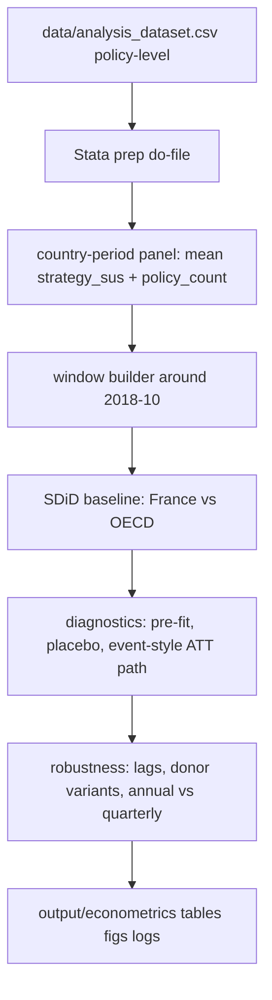

# feat: Estimate Yellow Vests effect on policy sustainability alignment with Stata SDiD

## Overview

Build Stata-first causal workflow to estimate effect of French Yellow Vests protests on sustainability alignment of FAOLEX policies. Main estimator: synthetic difference-in-differences (SDiD). Treated unit: France. Control pool baseline: OECD countries, with robustness windows and donor-pool variants.

## Problem Frame

Need counterfactual estimate for post-October-2018 policy sustainability alignment in France versus comparable countries. Raw dataset (`data/analysis_dataset.csv`) is policy-level; causal design requires collapsing to country-time panel and enforcing near-symmetric pre/post window around intervention. Request also asks to test lag controls (start at 12 lags), verify pre-trend quality, and optionally include policy-count intensity as covariate.

## Requirements Trace

- R1. Use Stata end-to-end for dataset prep, estimation, diagnostics, and result exports.
- R2. Main design uses SDiD (synthetic DiD) with intervention start anchored at October 2018.
- R3. Treated group is France; baseline donor pool is OECD countries excluding France.
- R4. Panel must be country-level (policy-level collapsed).
- R5. Window should be approximately symmetric around treatment date.
- R6. Include lagged outcome controls (starting point: 12 lags) and evaluate pre-trend balance.
- R7. Add optional covariate for policy volume (number of policies per country-period) when it improves fit.
- R8. Produce reproducible outputs (tables/figures/logs) under repo output conventions.

## Scope Boundaries

- In scope: sustainability alignment outcome (`strategy_sus`), country-time panel construction, SDiD estimation, placebo/robustness checks, reproducible Stata scripts.
- In scope: annual baseline plus higher-frequency robustness if annual timing blurs October 2018 cutoff.
- Out of scope: re-embedding texts, changing similarity model, redesigning dashboard/UI.
- Out of scope: causal interpretation beyond design assumptions (parallel trends/synthetic fit diagnostics define validity domain).

## Context & Research

### Relevant Code and Patterns

- `data/analysis_dataset.csv` contains policy-level outcome scores and country/date fields needed for collapse.
- `README.md` references legacy Stata usage (`strategy_similarity_trends.do`), so Stata integration pattern already acceptable in repo.
- `AGENTS.md` requires raw/derived data in `data/`, intermediate in `data/temp/`, final artifacts in `output/`.

### Institutional Learnings

- No dedicated econometrics workflow exists yet for SDiD in this repository; plan should include explicit script modularization and artifact paths.

### External References

- Stata `sdid` package documentation and inference options (to be pinned in script comments during implementation).

## Key Technical Decisions

- Unit of analysis = country-period panel: required for treatment assignment at country level.
- Baseline temporal aggregation = annual panel for interpretability; quarter-level robustness added to respect October 2018 timing.
- Baseline symmetric window target = 4 pre years + 4 post years around 2018 intervention anchor, adjusted only if support is insufficient.
- Outcome = mean `strategy_sus` per country-period; optional weighted versions deferred to robustness.
- Covariates = lagged outcome block (L1-L12 where frequency permits) + optional policy-count covariate to absorb activity shocks.
- Donor pool baseline = OECD-only; robustness expands/shrinks donor pool and enforces donor quality filters.

## Open Questions

### Resolved During Planning

- Primary treated unit: France only.
- Primary control architecture: OECD donor pool, France excluded.
- First estimator to implement: SDiD (not TWFE-first).
- Pre/post window preference: near-symmetric, not strictly forced if data support fails.

### Deferred to Implementation

- Exact OECD membership mapping to dataset country names (requires harmonization table in Stata prep script).
- Final lag depth under annual spec if limited pre-period observations force shorter lag block.
- Whether annual baseline should code 2018 as partial-treatment year or pre period with post starting 2019 in main specification.

## High-Level Technical Design

> *This illustrates intended approach and is directional guidance for review, not implementation specification. Implementing agent should treat it as context, not code to reproduce.*

## Implementation Units

- [ ] **Unit 1: Build reproducible Stata panel-prep pipeline**

**Goal:** Convert policy-level CSV to analysis-ready country-time panel with treatment flags and optional controls.

**Requirements:** R1, R4, R5, R7

**Dependencies:** None

**Files:**
- Create: `code/stata/prepare_yellow_vests_panel.do`
- Create: `data/temp/yellow_vests_country_year_panel.csv`
- Create: `data/temp/yellow_vests_country_quarter_panel.csv`

**Approach:**
- Import `data/analysis_dataset.csv` with UTF-8/BOM-safe settings.
- Parse `date_original` defensively; derive `year` and `quarter`.
- Collapse to country-period means for `strategy_sus`; compute `policy_count` per country-period.
- Build treatment indicators (`treated_france`, `post`, `treated_post`) for annual and quarterly variants.
- Create near-symmetric windows centered on intervention timing and keep window parameters configurable.

**Patterns to follow:**
- Script-style CLI pattern in `code/` and intermediate output discipline in `data/temp/`.

**Test scenarios:**
- Happy path: France and OECD controls appear with non-missing panel outcomes in selected window.
- Edge case: malformed or missing dates are dropped with explicit count report in log.
- Error path: missing required columns (`country`, `date_original`, `strategy_sus`) fails early with descriptive message.
- Integration: annual and quarterly panel outputs align with original record counts after collapse checks.

**Verification:**
- Panel files exist, row counts/log summaries reproducible, treatment timing variables consistent with October 2018 anchor.

- [ ] **Unit 2: Implement baseline SDiD estimation in Stata**

**Goal:** Estimate main ATT for Yellow Vests shock using France vs OECD synthetic DiD.

**Requirements:** R1, R2, R3, R5, R6

**Dependencies:** Unit 1

**Files:**
- Create: `code/stata/run_yellow_vests_sdid.do`
- Create: `output/econometrics/yellow_vests_sdid_main.csv`
- Create: `output/econometrics/yellow_vests_sdid_main.txt`
- Create: `output/econometrics/yellow_vests_gap_plot.png`

**Approach:**
- Load prepared annual panel first.
- Run SDiD with France treated unit and OECD donor set.
- Start with lagged outcome controls (target 12 lags; reduce only if window/df constraints require).
- Store ATT estimate, uncertainty interval, donor weights, and pre-treatment fit diagnostics.
- Export machine-readable and human-readable outputs.

**Execution note:** Start characterization-first for panel ordering and treatment timing before estimator call.

**Patterns to follow:**
- Existing repo artifact naming style (`output/<artifact>.{csv,png,txt}`).

**Test scenarios:**
- Happy path: baseline model converges and returns ATT with finite CI.
- Edge case: insufficient pre-period observations triggers controlled lag reduction rule and logs decision.
- Error path: empty donor pool after OECD filter aborts with actionable error.
- Integration: exported ATT table, text summary, and gap plot reference same sample/window.

**Verification:**
- One-command run produces baseline ATT artifacts in `output/econometrics/` and complete Stata log.

- [ ] **Unit 3: Add pre-trend diagnostics and placebo inference block**

**Goal:** Validate identifying assumptions and quantify whether observed ATT is unusual under placebo assignments.

**Requirements:** R2, R5, R6

**Dependencies:** Unit 2

**Files:**
- Create: `code/stata/run_yellow_vests_diagnostics.do`
- Create: `output/econometrics/yellow_vests_placebo_distribution.csv`
- Create: `output/econometrics/yellow_vests_placebo_plot.png`
- Create: `output/econometrics/yellow_vests_pretrend_table.csv`

**Approach:**
- Compute pre-treatment fit metrics and period-by-period gaps.
- Run placebo-in-space loop assigning pseudo-treatment to donor countries.
- Export empirical p-value, rank statistics, and visual distribution.
- Flag diagnostics thresholds that indicate weak counterfactual quality.

**Patterns to follow:**
- Output-focused workflow already used across repo analysis scripts.

**Test scenarios:**
- Happy path: placebo routine executes across donor units and returns full distribution.
- Edge case: small donor count still returns valid but flagged inference.
- Error path: diagnostics file write failure stops run before silent partial outputs.
- Integration: placebo sample excludes treated France and matches baseline donor universe.

**Verification:**
- Diagnostics folder contains pretrend table + placebo distribution + plot with reproducible counts.

- [ ] **Unit 4: Robustness grid (window symmetry, frequency, covariates, donor pool)**

**Goal:** Stress-test ATT sensitivity to core design choices requested by user.

**Requirements:** R3, R5, R6, R7

**Dependencies:** Unit 3

**Files:**
- Create: `code/stata/run_yellow_vests_robustness.do`
- Create: `output/econometrics/yellow_vests_robustness_grid.csv`
- Create: `output/econometrics/yellow_vests_robustness_plot.png`

**Approach:**
- Evaluate near-symmetric windows (e.g., +/-3, +/-4, +/-5 years where feasible).
- Compare annual vs quarterly specs (quarterly anchors intervention at 2018q4).
- Toggle policy-count covariate and lag-depth variants.
- Compare donor pools: OECD baseline, OECD-minus-outliers, broader non-OECD sensitivity.

**Patterns to follow:**
- Tabular summary outputs analogous to `output/descriptive_statistics.tex` generation spirit.

**Test scenarios:**
- Happy path: robustness grid records ATT and fit stats for all planned specifications.
- Edge case: infeasible specs (too few periods) marked as skipped with reason, not silently dropped.
- Error path: one failed spec does not erase prior successful spec results.
- Integration: robustness sample definitions consistent with prepared panel files.

**Verification:**
- Single robustness table identifies stable vs unstable ATT regions across window/covariate/donor choices.

- [ ] **Unit 5: Documentation and runbook for manual review in Stata**

**Goal:** Make workflow easy to audit and rerun by hand in Stata (user requirement).

**Requirements:** R1, R8

**Dependencies:** Units 1-4

**Files:**
- Modify: `README.md`
- Create: `docs/stata/yellow_vests_sdid_runbook.md`

**Approach:**
- Document script order, expected inputs/outputs, and interpretation cautions.
- Record required Stata packages and reproducibility assumptions.
- Link outputs for quick reviewer navigation.

**Patterns to follow:**
- README command-block style already used in project.

**Test scenarios:**
- Happy path: new contributor can reproduce full result set following runbook sequence.
- Integration: runbook paths match actual generated artifacts and script names.
- Test expectation: none -- documentation-only unit, no behavioral code surface.

**Verification:**
- Documentation paths and commands match real repository structure and artifact locations.

## System-Wide Impact

- **Interaction graph:** new Stata workflow consumes `data/analysis_dataset.csv`, emits panel intermediates to `data/temp/`, causal outputs to `output/econometrics/`.
- **Error propagation:** failures in panel prep must halt downstream SDiD/diagnostic scripts to avoid mixed-sample artifacts.
- **State lifecycle risks:** stale temp panels can contaminate reruns; scripts should overwrite or version outputs deterministically.
- **API surface parity:** no existing Python pipeline behavior changed; workflow additive.
- **Integration coverage:** consistency checks needed across prep sample, SDiD sample, and placebo sample.
- **Unchanged invariants:** embedding/similarity generation and dashboard pipeline remain untouched.

## Risks & Dependencies

| Risk | Mitigation |
|------|------------|
| Country-name mismatch breaks OECD filter | Add explicit harmonization map in prep script; log unmatched countries |
| Annual timing blurs October 2018 shock | Keep quarterly robustness with 2018q4 intervention anchor |
| Parallel-trend quality weak in baseline donor pool | Use pre-fit diagnostics + donor-pool sensitivity grid |
| Sparse pre-period with 12 lags | Apply deterministic lag fallback rule and report chosen lag depth |
| SDiD package/version drift in Stata | Pin install/check steps in runbook and script header comments |

## Documentation / Operational Notes

- Add dedicated section in `README.md` for Yellow Vests SDiD workflow and artifact paths.
- Keep Stata logs in `output/econometrics/logs/` for audit trail.
- If ATT highly specification-sensitive, report as exploratory evidence, not definitive causal claim.

## Sources & References

- Related data: `data/analysis_dataset.csv`
- Related repo docs: `README.md`, `AGENTS.md`
- Legacy Stata reference path: `code/strategy_similarity_trends.do`
- External docs: Stata `sdid` package reference (to cite explicitly in implementation docs)
